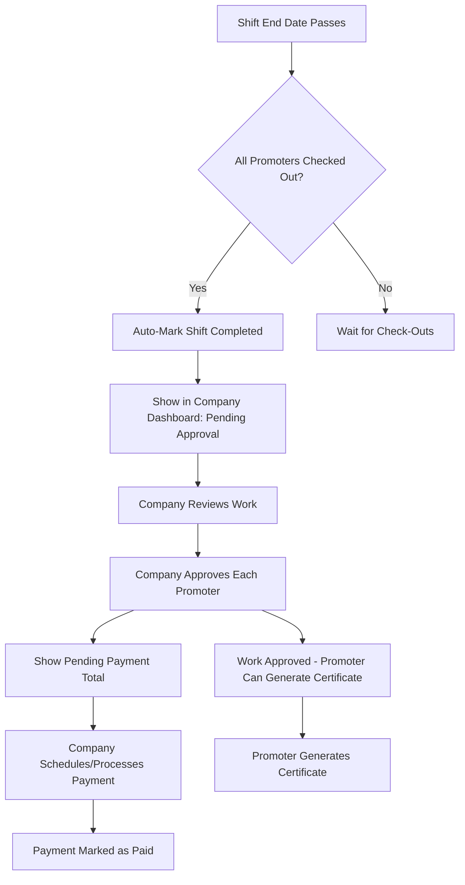

# Shift Completion & Approval Flow

## Overview
Implement a complete flow for shift completion, approval, payment tracking, and certificate generation. When a shift is completed, companies can review and approve promoter work, track pending payments, and promoters can generate certificates after approval.

## Database Changes

### 1. Add Shift Approval Fields
Add to `shift_assignments` table:
- `work_approved` (boolean, default false) - Company approved the promoter's work
- `work_approved_at` (timestamp) - When work was approved
- `work_approved_by` (uuid, FK to profiles) - Who approved the work
- `certificate_approved` (boolean, default false) - Already exists, keep it
- `certificate_approved_at` (timestamp) - When certificate was approved

### 2. Add Shift Completion Tracking
Add to `shifts` table:
- `auto_completed_at` (timestamp) - When shift was auto-marked as completed
- `manually_completed_at` (timestamp) - When company manually marked as completed
- `completed_by` (uuid, FK to profiles) - Who marked it completed

### 3. Create Function for Auto-Completion
Create database function that:
- Checks if shift end_date has passed
- Checks if all assigned promoters have checked out (no active sessions)
- Auto-marks shift as completed if conditions met
- Can be called via cron job or trigger

## Flow Diagram

## Implementation Steps

### Phase 1: Database Schema Updates

1. **Migration: Add approval fields to shift_assignments**
   - Add `work_approved`, `work_approved_at`, `work_approved_by`
   - Add indexes for querying pending approvals

2. **Migration: Add completion tracking to shifts**
   - Add `auto_completed_at`, `manually_completed_at`, `completed_by`
   - Update existing completed shifts if needed

3. **Create Auto-Completion Function**
   - Function: `check_and_complete_shifts()`
   - Checks shifts where end_date < today AND status != 'completed'
   - Verifies all assigned promoters have no active sessions
   - Marks shift as completed and sets `auto_completed_at`

4. **Create Cron Job**
   - Schedule function to run daily at midnight
   - Or use trigger on time_logs check_out

### Phase 2: Company Dashboard Updates

1. **Pending Approval Section**
   - Show shifts that are completed but have unapproved promoters
   - Display total pending payment amount
   - List each promoter with:
     - Total hours worked
     - Total earnings (base + extras)
     - Work sessions count
     - Approval status
     - Approve button

2. **Approval Actions**
   - Bulk approve all promoters for a shift
   - Individual approve per promoter
   - Show approval timestamp
   - Update payment status tracking

3. **Payment Summary Card**
   - Total pending payments (unapproved work)
   - Total approved but unpaid
   - Total paid this month

### Phase 3: Promoter Dashboard Updates

1. **Approval Status Display**
   - Show "Pending Approval" badge on completed shifts
   - Show "Work Approved" badge when approved
   - Display approval timestamp
   - Show "Certificate Ready" when work_approved = true

2. **Certificate Generation**
   - Only allow certificate generation if `work_approved = true`
   - Show message if work not yet approved
   - Update certificate generation logic

### Phase 4: Shift Details Pages

1. **Company Shift Details**
   - Add "Approve Work" section for each promoter
   - Show approval status and timestamp
   - Bulk approval option
   - Payment tracking per promoter

2. **Promoter Shift Details**
   - Show approval status prominently
   - Display approval timestamp if approved
   - Show certificate generation button (only if approved)

## Files to Create/Modify

### Database
1. **Migration**: `add_shift_approval_fields.sql`
2. **Migration**: `add_shift_completion_tracking.sql`
3. **Function**: `check_and_complete_shifts()` function
4. **Cron Job**: Schedule auto-completion check

### Components
1. **Company Dashboard**: `src/components/dashboard/CompanyDashboard.tsx`
   - Add pending approvals section
   - Add payment summary card

2. **Shift Approval Manager**: `src/components/shifts/ShiftApprovalManager.tsx` (new)
   - Component for approving promoter work
   - Bulk and individual approval

3. **Promoter Dashboard**: `src/components/dashboard/PromoterDashboard.tsx`
   - Update approval status display
   - Update certificate generation logic

4. **Shift Details**: `src/components/shifts/ShiftDetailContent.tsx`
   - Add approval section for companies
   - Show approval status for promoters

5. **Certificate Generation**: `src/pages/Certificates.tsx`
   - Check `work_approved` before allowing generation

### Hooks
1. **useShiftApproval.ts** (new)
   - Hook for approving promoter work
   - Fetch approval status

2. **usePendingApprovals.ts** (new)
   - Hook for fetching pending approvals for company

## User Stories

### Company User
1. **As a company**, I want to see all completed shifts with pending approvals
2. **As a company**, I want to see total pending payment amount
3. **As a company**, I want to approve each promoter's work individually
4. **As a company**, I want to bulk approve all promoters for a shift
5. **As a company**, I want to see when I approved each promoter's work

### Promoter User
1. **As a promoter**, I want to see if my work has been approved
2. **As a promoter**, I want to see when my work was approved
3. **As a promoter**, I want to generate a certificate only after work is approved
4. **As a promoter**, I want to see my payment status separately from approval

## Success Criteria
- ✅ Shifts auto-complete when end date passes and all promoters checked out
- ✅ Company dashboard shows pending approvals with total payment
- ✅ Company can approve individual or all promoters
- ✅ Approval timestamp is tracked and displayed
- ✅ Promoters can only generate certificates after approval
- ✅ Payment tracking is separate from work approval
- ✅ All approval statuses are accurate and real-time

